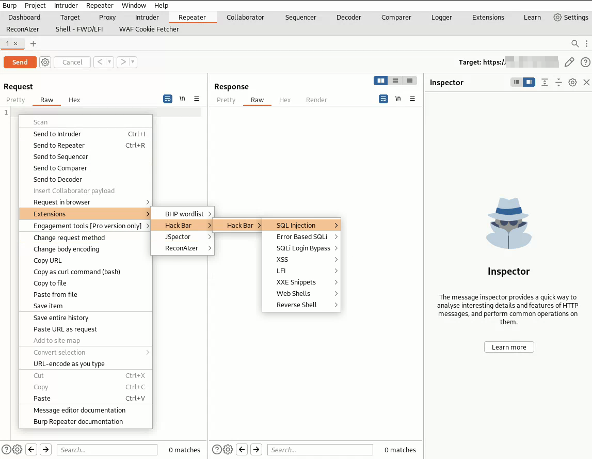

 

  

  <h3 align="center">‌Hack Bar(Burp extentione)</h3>

  

    the hackbar project , a burpsuit extention 
     
    Note this project is not done.
     
     
     
     
    <a href="https://intsagram.com/error._.fiat">Our instagram page</a>
    .
    <a href="https://youtube.com/error_fiat">Our youtube chanel</a>
    .
    <a href="https://twitter.com/ErrorFiat">Our twitter page</a>
  

## Items in the HackBar

- SQL Injection
- Error Bassed SQLI
- SQLI Login Bypass
- XSS
- LFI
- XXE Snippets
- Web Shells
- Reverse Shell
- SSTI

## usage

First of all, you need to go to the releases section of the project, then download the HackBar.jar file
After downloading, you should go to burpsuite and add the file you downloaded in the extension section according to the video.

## Upcoming Features/Modules

- Ctrl + H (shortcut)
- WAF bypass (SQLi)
- Decoder/Encoder

## Tested on

- Burpsuite 2023.4.3
- Windows 10 & 11
- Ubuntu & PopOS & debian

